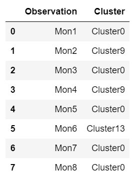

# LocationAnalytics

Creator - Brian & Cheng 
Date: 03/12/2018 
Main script : Predict User Location and Build Recommendation Model.ipynb 
Note: Location and Time Prediction Using DBSCAN and Markov Chain
* Visualisation script were adapted from http://angusmacnab.com/Location_SKLearn_Tut_MSData_0.2.html

Clustering using DBSCAN:  

 

Location Time Prediction using Markov Chain:  

 

